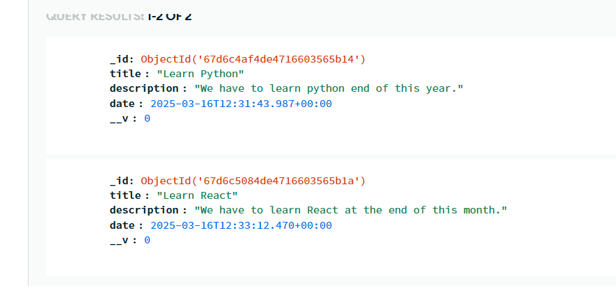
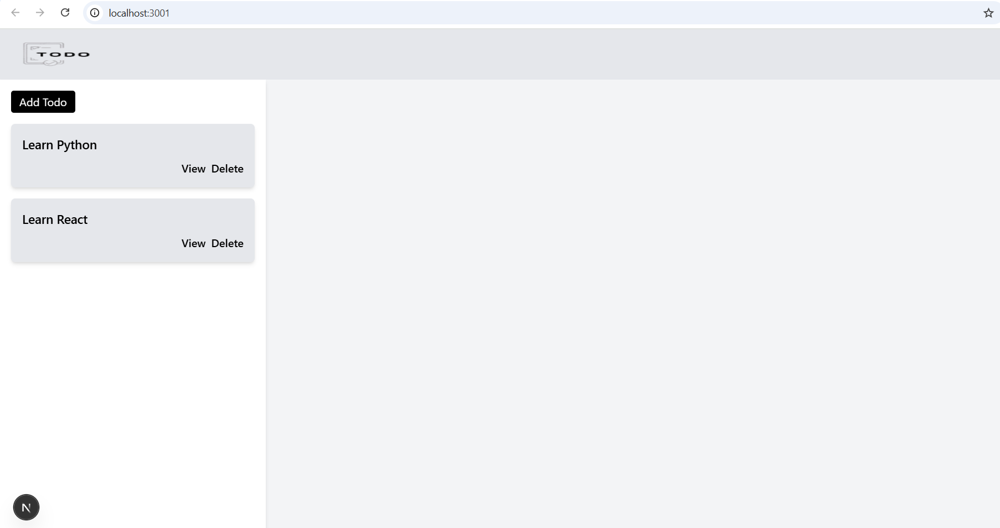

# 📌 Todo App (Full-Stack)

This is a full-stack Todo App built with **Next.js (App Router)** on the frontend and **Node.js, Express, and MongoDB** on the backend. The app allows users to **create, view, update, and delete** todos.

## 📝 Features
✅ Create a Todo: Add a new todo with a title and description.

✅ View Todos: Display a list of saved todos.

✅ Update Todos: Edit the title or description of an existing todo.

✅ Delete Todos: Remove a todo from the list.

✅ Pagination: Fetch todos in pages for better performance.

✅ Responsive Design:

     On large screens, the todo list remains visible while viewing/editing a todo.

     On small screens, viewing a todo hides the list for better focus.

✅ No Authentication: Open to all users.

## 🏗 Tech Stack

# Frontend (📌 /frontend folder)

Next.js (App Router)

React.js

TypeScript

Tailwind CSS

CSS Modules

# Backend (📌 /backend folder)
Node.js

Express.js

MongoDB (Mongoose)

Cors

Dotenv

## Deployment

1️⃣ Clone the Repository
   
       git clone https://github.com/yourusername/your-repo.git
       cd your-repo

# ⚙ Backend Setup

📌 Navigate to the backend folder:

             cd backend

📌 Install dependencies:
         
            npm Install

📌 Create a .env file inside the backend folder and add:

            PORT=5000
            MONGO_URI=your_mongodb_connection_string

📌 Run the backend server:
            
            npm run dev

# 🎨 Frontend Setup

📌 Navigate to the frontend folder:
      
         cd frontend

📌 Install dependencies:
        
         npm Install

📌 Run the frontend:

         npm run dev

Your frontend will start at:

👉 http://localhost:3000

## Screenshots
# Database sample image where we can see that it store title,description and date

# Application sample image

# 💼 Assignment Disclaimer

This project was developed as part of an Assignment to demonstrate full-stack development skills. 🚀
